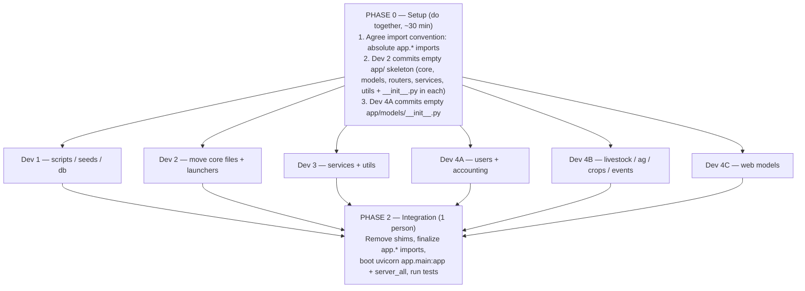
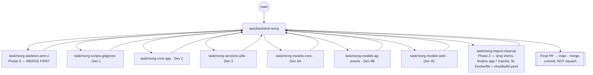

# Oatmeal Farm Network — Backend Refactor Tasks

> **Git repo root:** `oatmealfarmnetworkbackend/` (confirmed — this folder has its
> own `.git`, separate from the frontend repo). Every path below is relative to it.

---

## Target structure (agreed end-state — COMPLETE file tree)

> Every tracked file in the repo is listed below with its destination, so nobody
> assumes a folder is empty/complete and deletes something. Items marked
> **[DECIDE]** still need an owner/decision (see "Unassigned" at the bottom).
> `_uvicorn.err` / `_uvicorn.out` are kept locally but git-untracked (Dev 1).

```
oatmealfarmnetworkbackend/                 ← Git repo root (.git lives here)
│
├── .github/workflows/deploy-saige.yml
├── .claude/settings.local.json
├── .gitignore
├── .gcloudignore
│
├── app/                                   ← Core Python backend application
│   ├── main.py                            ← (moved from root) FastAPI entry point
│   ├── database.py                        ← (moved from root) Azure SQL connection
│   ├── dependencies.py                    ← (moved from root) global FastAPI deps
│   │
│   ├── core/                              ← Security / auth
│   │   ├── auth.py                        ← (moved from root auth.py)
│   │   └── jwt_auth.py                    ← (moved from root jwt_auth.py)
│   │
│   ├── models/                            ← (split from models.py — 59 classes)
│   │   ├── __init__.py                    ← re-exports all classes (backwards compat)
│   │   ├── users.py                       ← Dev 4A  (8 classes)
│   │   ├── accounting.py                  ← Dev 4A  (17 classes)
│   │   ├── marketplace.py                 ← Dev 4A  (placeholder / Pricing [DECIDE])
│   │   ├── livestock.py                   ← Dev 4B  (13 classes)
│   │   ├── precision_ag.py                ← Dev 4B  (10 classes)
│   │   ├── crops.py                       ← Dev 4B  (2 classes)
│   │   ├── events.py                      ← Dev 4B  (2 classes)
│   │   └── web.py                         ← Dev 4C  (6 classes)
│   │
│   ├── routers/                           ← (moved from root routers/) API routes
│   │   ├── __init__.py
│   │   ├── accounting.py        agro_consultations.py   animals.py
│   │   ├── associations.py      auth.py                 blog.py
│   │   ├── businesses.py        buyer_crm.py            ca_storage.py
│   │   ├── cash_flow.py         certifications.py       chilling_hours.py
│   │   ├── climate_forecast.py  cold_chain.py           commodity_history.py
│   │   ├── company_features.py  compliance_audit.py     crop_budgets.py
│   │   ├── crop_monitor_proxy.py crop_planning.py       crop_rotation.py
│   │   ├── crop_summary.py      csa.py                  csa_advanced.py
│   │   ├── dashboard.py         delivery_routes.py      document_vault.py
│   │   ├── education.py         equipment_maintenance.py equipment_marketplace.py
│   │   ├── esci.py              esg_reports.py          export_compliance.py
│   │   ├── events.py            farm_infrastructure.py  farm_inputs.py
│   │   ├── farm_kpi.py          farm_pl.py              farm_safety.py
│   │   ├── farm_stand.py        farmer_settlement.py    field_activity.py
│   │   ├── field_assessment_report.py field_health.py   field_health_alerts.py
│   │   ├── field_maturity.py    food_aggregator.py      food_wanted.py
│   │   ├── forgot_password.py   grain_bin.py            grants.py
│   │   ├── harvest_bins.py      harvest_lots.py         harvest_scheduling.py
│   │   ├── herd_health.py       hr.py                   ingredient_knowledgebase.py
│   │   ├── iot_greenhouse.py    irrigation.py           job_board.py
│   │   ├── land_leasing.py      livestock.py            market_alerts.py
│   │   ├── marketplace.py       meat.py                 meetings.py
│   │   ├── mill.py              my_registrations.py     news.py
│   │   ├── notes.py             notifications.py        nursery.py
│   │   ├── nutrients.py         outgrower.py            packhouse_qc.py
│   │   ├── perishable_trace.py  picker_performance.py   plant_knowledgebase.py
│   │   ├── plant_tagging.py     platform_services.py    platform_settings.py
│   │   ├── platform_subscriptions.py precision_ag.py    precision_ag_features.py
│   │   ├── price_list.py        processed_food.py       procurement.py
│   │   ├── produce.py           provenance.py           ranches.py
│   │   ├── rbac.py              recipes_batches.py      reports.py
│   │   ├── scale_tickets.py     scouting.py             scraper_knowledge.py
│   │   ├── seed_varieties.py    services.py             sfproducts.py
│   │   ├── soil_tests.py        spray_applications.py   stripe_payments.py
│   │   ├── supplier_directory.py supplier_scorecard.py  supply_chain.py
│   │   ├── supply_chain_ai.py   supply_chain_events.py  thaiyme.py
│   │   ├── translation.py       users.py                weather.py
│   │   ├── website_ai.py        website_builder.py      work_orders.py
│   │   ├── yield_records.py
│   │   │
│   │   │   # The 27 event_* modules (full filenames):
│   │   ├── event_analytics.py   event_auction.py        event_booth_services.py
│   │   ├── event_broadcast.py   event_checkin.py        event_coi.py
│   │   ├── event_competition.py event_conference.py     event_dining.py
│   │   ├── event_exports.py     event_farm_tour.py      event_features.py
│   │   ├── event_fiber_arts.py  event_fleece.py         event_floor_plan.py
│   │   ├── event_halter.py      event_leads.py          event_mailing_list.py
│   │   ├── event_meals.py       event_promo_codes.py    event_registration_cart.py
│   │   ├── event_simple.py      event_spinoff.py        event_sponsorship.py
│   │   └── event_testimonials.py event_vendor_fair.py   event_waitlist.py
│   │   #  (events.py — the plural main events router — is listed above, separate)
│   │
│   ├── services/                          ← (moved from root) business logic / mailers / APIs  [Dev 3]
│   │   ├── external_apis.py
│   │   ├── image_service.py
│   │   ├── marketplace_accounting.py
│   │   ├── marketplace_catalog.py
│   │   ├── marketplace_stripe.py
│   │   ├── marketplace_emails.py
│   │   ├── herd_health_accounting.py
│   │   ├── event_emails.py
│   │   └── meeting_emails.py
│   │
│   └── utils/                             ← (moved from root) generic helpers  [Dev 3]
│       ├── geo_utils.py
│       ├── gee_helper.py
│       └── page_templates.py
│
├── saige/                                 ← AI advisory subsystem (ISOLATED — NOT moved into app/)
│   ├── api.py            graph.py          nodes.py          llm.py
│   ├── rag.py            config.py         database.py       jwt_auth.py
│   ├── models.py         saige_models.py   redis_client.py   push_notifications.py
│   ├── chat_history.py   history_store.py  message_buffer.py learning.py
│   ├── knowledge_base.py sync_embeddings.py backfill_embeddings.py
│   ├── actions.py        business_data.py  business_ops.py   farm_data.py
│   ├── farm_digest.py    cross_links.py    Data_Contract.py  user_profile.py
│   ├── events.py         crop_names.py     region_crops.py   companion_planting.py
│   ├── agronomy.py       chef.py           cassia.py         rosemarie.py
│   ├── pairsley.py       insurance.py      subsidies.py      subsidies_intl.py
│   ├── soil_challenges.py pest_detection.py price_forecast.py precision_ag.py
│   ├── weather.py        weather_alerts.py weather_mitigation.py jokes.py
│   ├── seed_firestore.py combined_backend.py main.py
│   ├── test_main.py      test_api_flow.py  test_redis.py     pytest.ini
│   ├── requirements.txt  docker-compose.yml Dockerfile       Dockerfile.backend
│   ├── deploy.ps1
│   ├── bussiness_logic.ipynb  livestock.ipynb
│   ├── farm_advisory_graph.png  livestock_graph.png
│   ├── README.md  HANDOFF.md  BUGFIX_SUMMARY.md  CHANGELOG_2026-02-11.md  LOADING_STATES.md
│   └── null                                ← [DECIDE] junk file — delete
│
├── scrapers/                              ← Data aggregation / scrapers (own top-level folder)
│   ├── __init__.py
│   └── lavendir_scraper.py
│
├── scripts/                               ← Maintenance / ad-hoc / cron  [Dev 1]
│   ├── backfill_field_size_from_boundary.py   ← already here
│   ├── import_sfproducts.py                    ← already here
│   ├── generate_knowledgebase_images.py        ← (moved from root)
│   ├── check_cc_tables.py                       ← (moved from root)
│   ├── ofn-cron.ps1                             ← already here
│   │
│   ├── migrations/                        ← Python patch scripts (moved from root)
│   │   ├── migrate_animal_photos.py
│   │   ├── migrate_image_styling.py
│   │   ├── migrate_screen_page_bg.py
│   │   ├── migrate_typography_italic_px.py
│   │   └── migrate_website_columns.py
│   │
│   └── seeds/                             ← DB seed scripts (root + existing scripts/ ones)
│       ├── seed_accounting_15671.py
│       ├── seed_cold_chain_15671.py
│       ├── seed_cold_chain_advanced_15671.py
│       ├── seed_cold_chain_may4_15671.py
│       ├── seed_cold_chain_recent_15671.py
│       ├── seed_cold_chain_shipments_maint_15671.py
│       ├── seed_demo_15671.py   seed_demo_15671b.py   seed_demo_15671c.py   seed_demo_15671d.py
│       ├── seed_edu_15671.py    seed_grants_15671.py  seed_livestock_15665.py
│       ├── seed_orders_15671.py seed_precision_ag_15671.py seed_suppliers_15671.py
│       ├── seed_test_data_15665.py
│       ├── seed_activity_journal_15665.py  ← (already in scripts/)
│       ├── seed_aggregator.py              ← (already in scripts/)
│       ├── seed_alerts_15665.py            ← (already in scripts/)
│       ├── seed_analyses_15665.py          ← (already in scripts/)
│       ├── seed_carbon_15665.py            ← (already in scripts/)
│       ├── seed_full_15665.py              ← (already in scripts/)
│       └── upload_local_animal_photos.py   ← (moved from root)
│
├── db/                                    ← Database schema layer
│   └── migrations/                        ← SQL schema DDL (renamed from root migrations/)
│       │                                     NOTE: this is .sql DDL — NOT the same as
│       │                                     scripts/migrations/*.py (Python patch scripts)
│       ├── add_alpaca_percent_columns.sql
│       ├── add_business_description.sql
│       ├── add_businesswebsite_columns.sql
│       ├── add_field_biomass_analysis.sql
│       ├── add_menu_style_json.sql
│       ├── add_page_link_url.sql
│       ├── add_precision_ag_features.sql
│       ├── add_precision_ag_features2.sql
│       ├── blog_restructure.sql
│       ├── create_field_assessment_report.sql
│       ├── create_field_maturity_sample.sql
│       ├── create_herd_health_reproduction.sql
│       ├── create_herd_health_tables.sql
│       └── merge_scouting_into_notes.sql
│
├── data/  [DECIDE]                        ← suggested home for loose root .sql data dumps
│   ├── aggregator_sales_test_data_15671.sql
│   ├── esci_test_data_15671.sql
│   └── seed_oatmeal_ai.sql
│
├── docs/
│   ├── SYSTEM.md
│   └── architecture.png                    ← [DECIDE] (moved from root architecture.png)
│
├── src/                                   ← Legacy infrastructure
│   └── index.js                            ← Legacy Node/Express API (port 3001)
│
├── server_all.py                          ← Unified launcher (update to app/main.py + saige; drop CropMonitor phase)
├── Dockerfile                             ← Core app container (→ uvicorn app.main:app)
├── cloudbuild.yaml                        ← GCP deploy pipeline
├── requirements.txt                       ← Core app dependencies
├── README.md
├── Tasks.md                               ← this file
│
├── main.jsx                               ← [DECIDE] stray React file at backend root — move to src/ or delete
├── _uvicorn.err                           ← untracked + gitignored (Dev 1)
└── _uvicorn.out                           ← untracked + gitignored (Dev 1)
```

---

## Key decisions

- **Models live at `app/models/`** (a package inside `app/`). Its `__init__.py`
  re-exports every class so callers use `from app.models import People` instead of
  `from app.models.users import People`.
  - **Import impact:** flat imports (`from models import ...`, `from database import ...`,
    `from auth import ...`) eventually become `app.*`. During the refactor, **shim
    files** at the old paths keep everything working, so the rewrite is a Phase 2
    cleanup — not a blocker (see "How the work runs").
- **`saige/` stays at the repo root** as an isolated sandbox — it is **not** moved
  into `app/`. This deliberately avoids the `sys.modules` collision that
  `server_all.py` works around.
- **No `CropMonitoringBackend/`** in the target. `server_all.py` currently
  `raise`s a `RuntimeError` if that directory is missing, so Dev 2 must remove its
  CropMonitor load phase.
- **`models.py` is ~1,049 lines / 59 classes** (the "50k" figure is template
  hyperbole — kept here only as a label).

---

## How the work runs — 3 phases (NOT a linear chain)

The tasks are **mostly parallel**. There are only two true "must-be-first" steps;
everything else runs simultaneously, then a short integration pass at the end.



**Phase 1 = all six work in parallel.** The thing that makes this safe is **shims**:
when Dev 2 moves `database.py`/`auth.py` and Dev 4A moves the models, they leave a
one-line forwarding file at the OLD path so existing imports keep working:

```python
# database.py  (temporary shim at old location)
from app.database import *        # noqa
```

```python
# models.py  (temporary shim once classes move into app/models/)
from app.models import *          # noqa
```

With shims in place, nobody has to wait for anyone else's import rewrite. The
final `app.*` cleanup + shim removal happens once, in Phase 2.

**Only real ordering rules:**
1. Dev 2's empty `app/` skeleton is committed before files move into it (Phase 0).
2. Dev 4A's empty `app/models/__init__.py` exists before 4B/4C append to it (Phase 0).

**Shared files to coordinate (conflicts, not blockers):**
- `models.py` — 4A/4B/4C all cut from it → each removes only their own classes.
- `app/models/__init__.py` — 4A/4B/4C all append one line each.
- `routers/*.py` — Dev 2 moves them (`git mv`); Dev 3 edits imports inside them
  afterward (shims mean Dev 3 isn't urgent).

---

## Branching Strategy — Epic + short-lived feature branches

Use one **Epic (integration) branch** for the whole reorg, with small **task
branches** cut off it. `main` stays shippable the entire time; the messy
in-between states live on the epic branch.



**Branch → owner → target (all task PRs target `epic/backend-reorg`):**

| Branch | Owner | Phase |
|--------|-------|-------|
| `task/reorg-skeleton-and-ci` | Dev 2 + Dev 4A | 0 — merge first (empty `app/` skeleton, `app/models/__init__.py`, smoke CI) |
| `task/reorg-scripts-gitignore` | Dev 1 | 1 |
| `task/reorg-core-app` | Dev 2 | 1 |
| `task/reorg-services-utils` | Dev 3 | 1 |
| `task/reorg-models-core` | Dev 4A | 1 |
| `task/reorg-models-ag-events` | Dev 4B | 1 |
| `task/reorg-models-web` | Dev 4C | 1 |
| `task/reorg-import-cleanup` | Dev 2 (lead) | 2 — last merge before final PR |

**Rules (non-negotiable):**
1. **Epic is short-lived** — days, not weeks. This is the #1 defense against
   merge hell.
2. **Sync daily:** `git checkout epic/backend-reorg && git merge main`. Resolve
   small conflicts while they're small. **Merge** into the shared epic — never
   rebase a branch others have checked out.
3. **Move and edit in SEPARATE commits.** Commit `git mv` alone, then rewrite
   imports in a follow-up commit. Combining them breaks git rename detection and
   makes every sync conflict manual. (Shims make this natural: move + shim first,
   import cleanup later.)
4. **Task branches stay small** (~10–20 files) so PRs into epic are reviewable.
   Rebasing a task branch onto epic is fine (single owner, short-lived).
5. **Merge gate per task PR:** the app must still boot — `python -c "import app.main"`
   (or a 5-second uvicorn start). This is the only safety net (no test suite).
6. **Final PR `epic → main` uses a merge commit, not squash** — squashing 150
   moved files destroys per-file history and `git log --follow`.

**CI/CD notes (specific to this repo):**
- `task/reorg-skeleton-and-ci` should add a tiny smoke workflow
  (`pip install -r requirements.txt` + `python -c "import app.main"`) — there is
  currently **no test/CI gate** for the main app.
- `.github/workflows/deploy-saige.yml` is **path-scoped to `saige/**`** and builds
  from `./saige`; since `saige/` is not moving, leave it untouched.
- `Dockerfile` + `cloudbuild.yaml` change in Phase 2 — there is no PR gate on them,
  so **`docker build` + boot locally** before the final PR.

---

## Developer 1: Git Cleanup & Script Consolidation — Sai Ram

**Goal:** stop tracking log artifacts; move all loose scripts/SQL into `scripts/` and `db/`.

**Branch:**
```bash
git checkout epic/backend-reorg && git pull
git checkout -b task/reorg-scripts-gitignore
# ...do the steps below, commit (keep `git mv` and edits in separate commits)...
git push -u origin task/reorg-scripts-gitignore
# Open PR:  task/reorg-scripts-gitignore  →  epic/backend-reorg
```

**Steps:**
1. In `.gitignore`, add two lines: `*.err` and `*.out` (`*.log` is already there).
2. `git rm --cached _uvicorn.err _uvicorn.out` (untracks them; keeps local copies).
3. Create folders: `scripts/migrations/`, `scripts/seeds/`, `db/migrations/`.
4. `git mv` the 5 `migrate_*.py` (root) → `scripts/migrations/`.
5. `git mv` every root `seed_*.py` **and** `upload_local_animal_photos.py` → `scripts/seeds/`.
6. `git mv` the 6 seeds already in `scripts/` (`seed_full_15665.py`, `seed_carbon_15665.py`, `seed_alerts_15665.py`, `seed_analyses_15665.py`, `seed_activity_journal_15665.py`, `seed_aggregator.py`) → `scripts/seeds/`.
7. `git mv` root maintenance scripts `check_cc_tables.py` and `generate_knowledgebase_images.py` → `scripts/`.
8. `git mv` root `migrations/*.sql` → `db/migrations/`.
9. **Phase 2:** in the moved scripts, fix imports (`from database import ...` → `from app.database import ...`) once Dev 2's shims are removed.

**Done when:** repo root has no loose `seed_*`, `migrate_*`, or `*.sql` files; `_uvicorn.*` no longer show in `git status`.

---

## Developer 2: Core Application Enclosure (`app/`) — David

**Goal:** create the `app/` package, move core runtime files in, fix the launchers. **Owns Phase 0.**

**Branch:** Dev 2 does the work in TWO branches — the Phase 0 skeleton first (shared with 4A), then the core move.
```bash
# --- Phase 0 (MERGE FIRST, before anyone else starts) ---
git checkout epic/backend-reorg && git pull
git checkout -b task/reorg-skeleton-and-ci
#   create empty app/ + subfolders + __init__.py, add smoke-CI workflow,
#   and include 4A's empty app/models/__init__.py
git push -u origin task/reorg-skeleton-and-ci
# PR:  task/reorg-skeleton-and-ci  →  epic/backend-reorg   (merge before Phase 1)

# --- Phase 1 (after skeleton is on epic) ---
git checkout epic/backend-reorg && git pull
git checkout -b task/reorg-core-app
# ...steps 2–7 below...
git push -u origin task/reorg-core-app
# PR:  task/reorg-core-app  →  epic/backend-reorg
```

**Steps:**
1. **(Phase 0)** Create `app/` with subfolders `core/`, `models/`, `routers/`, `services/`, `utils/`, each containing an empty `__init__.py`. Commit this skeleton first — it unblocks everyone.
2. `git mv main.py database.py dependencies.py` → `app/`.
3. `git mv auth.py jwt_auth.py` → `app/core/` (top-level only; `routers/auth.py` stays put).
4. `git mv routers/` → `app/routers/`.
5. Add **shims** at the old root paths so other devs aren't blocked:
   - `database.py` → `from app.database import *`
   - `auth.py` → `from app.core.auth import *`
   - `jwt_auth.py` → `from app.core.jwt_auth import *`
6. `Dockerfile`: change CMD `uvicorn main:app` → `uvicorn app.main:app`.
7. `server_all.py`: point the file-path load to `app/main.py`; **delete the CropMonitor phase** (it raises `RuntimeError` because `CropMonitoringBackend/` doesn't exist); confirm `saige/` still loads.
8. **(Phase 2)** Rewrite `app/` internals to absolute `app.*` imports, then delete the shims.

**Convention (locked):** absolute `app.*` imports, run via `uvicorn app.main:app` from repo root.

**Do NOT touch:** `saige/` (stays at root, isolated).

**Done when:** `uvicorn app.main:app` boots locally, and `server_all.py` starts the main app + saige with no CropMonitor error.

---

## Developer 3: Services & Utilities Consolidation — Sankeerth

**Goal:** move business-logic and helper modules into `app/services/` and `app/utils/`.

**Branch:** (start after `task/reorg-skeleton-and-ci` is merged into epic)
```bash
git checkout epic/backend-reorg && git pull
git checkout -b task/reorg-services-utils
# ...do the steps below...
git push -u origin task/reorg-services-utils
# Open PR:  task/reorg-services-utils  →  epic/backend-reorg
```

**Steps:**
1. `git mv` these 9 files → `app/services/`: `external_apis.py`, `image_service.py`, `marketplace_accounting.py`, `marketplace_catalog.py`, `marketplace_stripe.py`, `marketplace_emails.py`, `herd_health_accounting.py`, `event_emails.py`, `meeting_emails.py`.
2. `git mv` these 3 files → `app/utils/`: `geo_utils.py`, `gee_helper.py`, `page_templates.py`.
3. Add a shim at each old root path (e.g. `marketplace_stripe.py` → `from app.services.marketplace_stripe import *`) so routers keep working mid-refactor.
4. **(Phase 2)** Update importers to `from app.services import X` / `from app.utils import X`, then delete shims. Affected: `routers/marketplace.py`, `routers/stripe_payments.py`, the `event_*` routers, `website_builder.py`, `website_ai.py`, `meetings.py`.

**Not yours:** `generate_knowledgebase_images.py` → `scripts/` (Dev 1); `scrapers/` stays a top-level folder.

**Done when:** all 12 files live under `app/services` or `app/utils`, and the app boots with services imported via `app.*`.

---

## Developer 4A: Models Foundation & Core Domains — Bringesh

**Goal:** turn `models.py` into the `app/models/` package; extract users + accounting. **Owns the package scaffold.**

**Branch:** the empty `app/models/__init__.py` ships in Phase 0 via Dev 2's
`task/reorg-skeleton-and-ci` (coordinate with David). Your domain work is its own branch:
```bash
git checkout epic/backend-reorg && git pull   # must already contain app/models/__init__.py
git checkout -b task/reorg-models-core
# ...steps below; keep `git mv`/cut commits separate from import edits...
git push -u origin task/reorg-models-core
# Open PR:  task/reorg-models-core  →  epic/backend-reorg
# Then tell 4B + 4C the moment this is merged.
```

**Steps:**
1. **(Phase 0)** Commit an empty `app/models/__init__.py` first — this unblocks 4B/4C.
2. Create `app/models/users.py`; at the top: `from app.database import Base`. Move these 8 classes (search `class X(Base):` in `models.py`):
   `People`, `Business`, `Address`, `BusinessAccess`, `BusinessTypeLookup`, `Country`, `StateProvince`, `Websites`.
3. Create `app/models/accounting.py` (same `Base` import). Move these 17:
   `AccountType`, `Account`, `JournalEntry`, `JournalEntryLine`, `AccountingCustomer`, `AccountingVendor`, `Item`, `Invoice`, `InvoiceLine`, `Payment`, `PaymentApplication`, `Bill`, `BillLine`, `Expense`, `ExpenseLine`, `FiscalYear`, `FiscalPeriod`.
4. Create `app/models/marketplace.py` as a placeholder with a comment (no ORM models exist today — marketplace is Pydantic in `routers/marketplace.py` + `marketplace_catalog.py`). Decide `Pricing`'s home here or in `users.py`.
5. In `app/models/__init__.py` add: `from .users import *` and `from .accounting import *`.
6. Add a shim: old `models.py` → `from app.models import *` so `from models import People` still works during the transition.
7. Tell 4B and 4C the instant `__init__.py` is merged so they can append.

**Naming note:** real classes are `People` / `Business` — NOT `User` / `Organization`.

**Done when:** `from app.models import People, Invoice` works and the app boots.

---

## Developer 4B: Agricultural & Event Domains — Navdeep

**Goal:** extract livestock, precision-ag, crop, and event models into `app/models/`. **Starts after 4A's `__init__.py` is merged.**

**Branch:** (wait until `task/reorg-models-core` is merged into epic so `__init__.py` exists)
```bash
git checkout epic/backend-reorg && git pull
git checkout -b task/reorg-models-ag-events
# ...do the steps below...
git push -u origin task/reorg-models-ag-events
# Open PR:  task/reorg-models-ag-events  →  epic/backend-reorg
```

**Steps:** each new file begins with `from app.database import Base`; move classes by searching `class X(Base):` in `models.py`.
1. `app/models/livestock.py` (13): `Animal`, `AnimalRegistration`, `AnimalColor`, `Ancestor`, `AncestryPercent`, `Fiber`, `Award`, `SpeciesAvailable`, `SpeciesBreedLookup`, `SpeciesColorLookup`, `SpeciesRegistrationTypeLookup`, `SpeciesCategory`, `Photo`.
2. `app/models/precision_ag.py` (10): `Field`, `FieldNote`, `FieldBiomassAnalysis`, `FieldMaturitySample`, `FieldHarvestTarget`, `FieldAssessmentReport`, `FieldScout`, `FieldSoilSample`, `FieldPrescription`, `FieldActivityLog`.
3. `app/models/crops.py` (2): `Produce`, `CropRotationEntry`.
4. `app/models/events.py` (2): `Event`, `Association`.
5. Append to `__init__.py`: `from .livestock import *`, `from .precision_ag import *`, `from .crops import *`, `from .events import *`.

**Warning:** `HerdHealth` and `CropBudget` are routers (`routers/herd_health.py`, `routers/crop_budgets.py`), NOT classes in `models.py` — don't hunt for them.

**Done when:** all 27 classes import cleanly via `from app.models import ...`.

---

## Developer 4C: Website Builder & Content Models — Guia

**Goal:** extract the 6 website-builder models nobody else owns. **Starts after 4A's `__init__.py` is merged.**

**Branch:** (wait until `task/reorg-models-core` is merged into epic)
```bash
git checkout epic/backend-reorg && git pull
git checkout -b task/reorg-models-web
# ...do the steps below...
git push -u origin task/reorg-models-web
# Open PR:  task/reorg-models-web  →  epic/backend-reorg
```

**Steps:**
1. Create `app/models/web.py` with `from app.database import Base`; move (6): `BusinessWebsite`, `BusinessWebPage`, `BusinessWebBlock`, `WebsiteCustomDomain`, `SiteSettings`, `BusinessBlogPost`.
2. Do NOT move `Websites` — that one belongs to 4A's `users.py`.
3. Append to `__init__.py`: `from .web import *`.

**Done when:** `models.py` has zero remaining `class ... (Base):` definitions (only the shim line remains).

---

## Phase 2: Integration & cutover — Dev 2 (lead)

**Goal:** once all Phase 1 task PRs are merged into epic, remove the shims, finalize
imports, and ship the whole reorg to `main`.

**Branch:** (run only after every Phase 1 PR is merged into epic)
```bash
git checkout epic/backend-reorg && git pull
git merge main                          # final sync; resolve any small conflicts
git checkout -b task/reorg-import-cleanup
# ...steps below...
git push -u origin task/reorg-import-cleanup
# Open PR:  task/reorg-import-cleanup  →  epic/backend-reorg
```

**Steps:**
1. Delete every shim file (old `database.py`, `auth.py`, `jwt_auth.py`, `models.py`, and the `app/services`/`app/utils` shims).
2. Rewrite remaining flat imports to `app.*` (`from database import` → `from app.database import`, `from models import` → `from app.models import`, etc.) across `app/`, `scripts/`, `scrapers/`.
3. Update `Dockerfile` (`uvicorn app.main:app`) and `cloudbuild.yaml` paths; `docker build` + boot locally (no PR gate on these).
4. Boot check: `uvicorn app.main:app` and `python server_all.py` both start clean.

**Done when:** no shim files remain, nothing imports the old flat paths, and the app + `server_all.py` boot.

### Final PR — epic → main
```bash
# After Phase 2 is merged into epic and the app boots on epic:
# Open PR:  epic/backend-reorg  →  main
# Use a MERGE COMMIT (do NOT squash — preserves the git mv rename history).
```

---

## Coverage check — all 59 classes mapped

| Owner | File | Count |
|-------|------|-------|
| 4A | `users.py` | 8 |
| 4A | `accounting.py` | 17 |
| 4A | `marketplace.py` | 0 (placeholder) |
| 4B | `livestock.py` | 13 |
| 4B | `precision_ag.py` | 10 |
| 4B | `crops.py` | 2 |
| 4B | `events.py` | 2 |
| 4C | `web.py` | 6 |
| — | (Pricing) | 1 — assign to `marketplace.py` or `users.py` |

> The diagram in your structure only listed 4 model files for brevity; the full
> split needs **8** files to cover all 59 classes without leftovers.

---

## Unassigned / decisions for standup

1. **`src/index.js`** (legacy Node/Express, port 3001) — keep, deprecate, or
   document? No task owns it.
2. **`main.jsx`** — stray React file sitting in the backend root. Move to `src/`
   or delete; confirm nothing imports it.
3. **`Pricing`** model — `marketplace.py` or `users.py`?
4. **Import namespace** (`app.*` vs path-injection) — Dev 2 must decide first;
   it dictates the `Base` import line in every model file.
5. **`saige/`** — stays isolated at root; confirm `server_all.py` still loads it
   after Dev 2's path change. Delete the junk `saige/null` file.
6. **Two "migrations" concepts (RESOLVED)** — the SQL DDL set is renamed to
   **`db/migrations/`** (`.sql`), while the Python patch scripts live in
   **`scripts/migrations/`** (`.py`). Two distinct folders, no name clash.
7. **Loose root `.sql` data dumps** (`aggregator_sales_test_data_15671.sql`,
   `esci_test_data_15671.sql`, `seed_oatmeal_ai.sql`) — suggested `data/`; confirm.
8. **`architecture.png`** — move to `docs/` (proposed) or keep at root.
9. **`scrapers/`** — confirmed as its own top-level folder (not under Dev 3).
